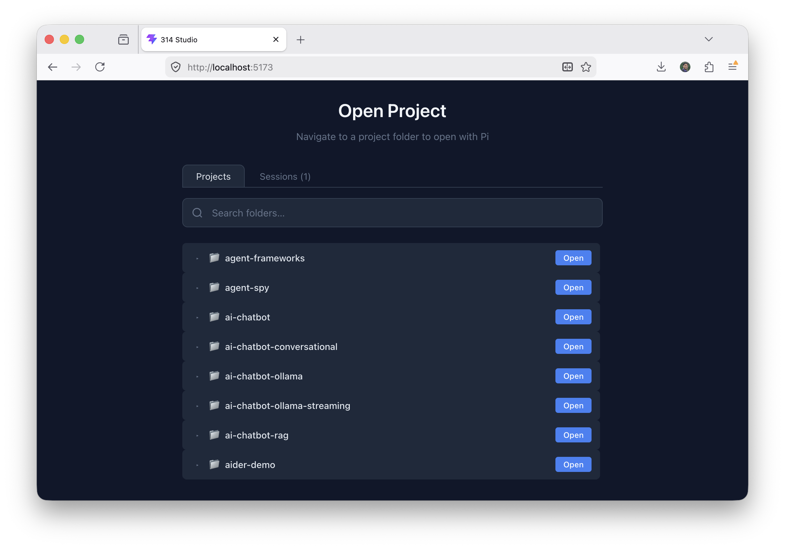
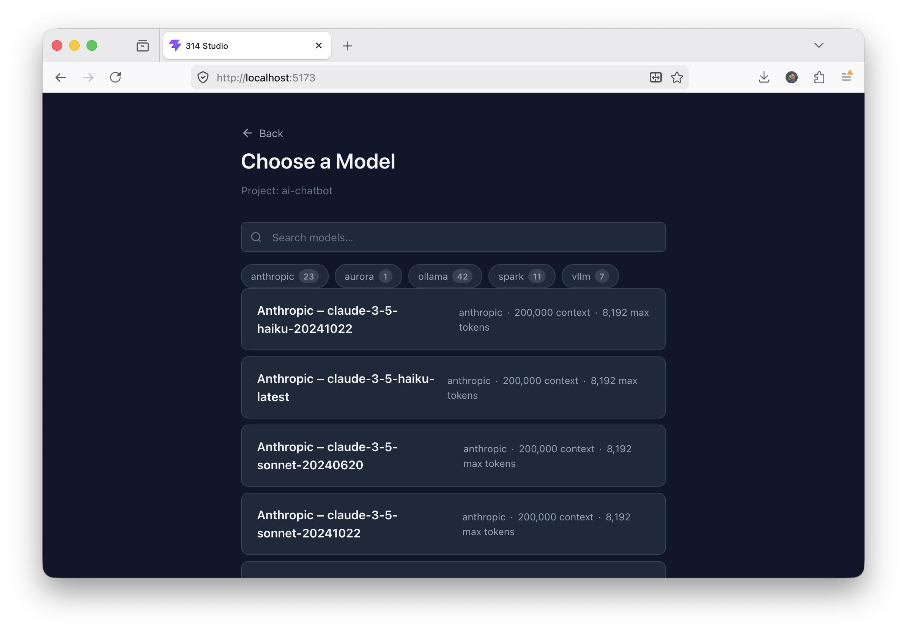
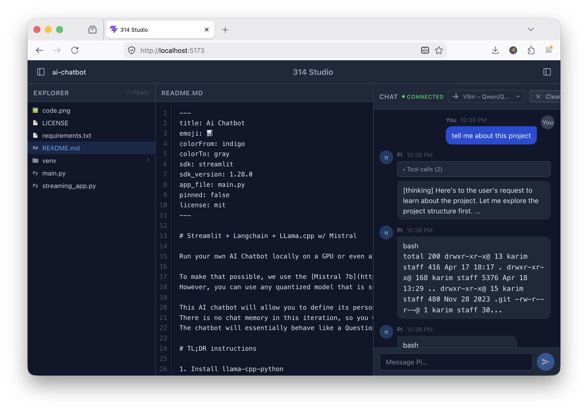
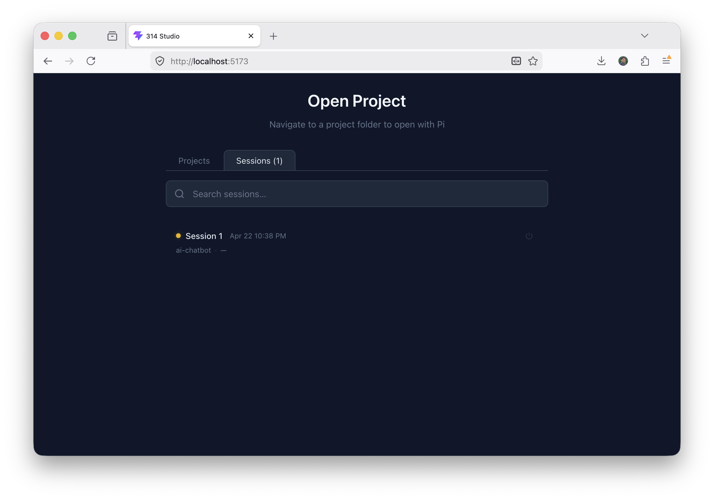
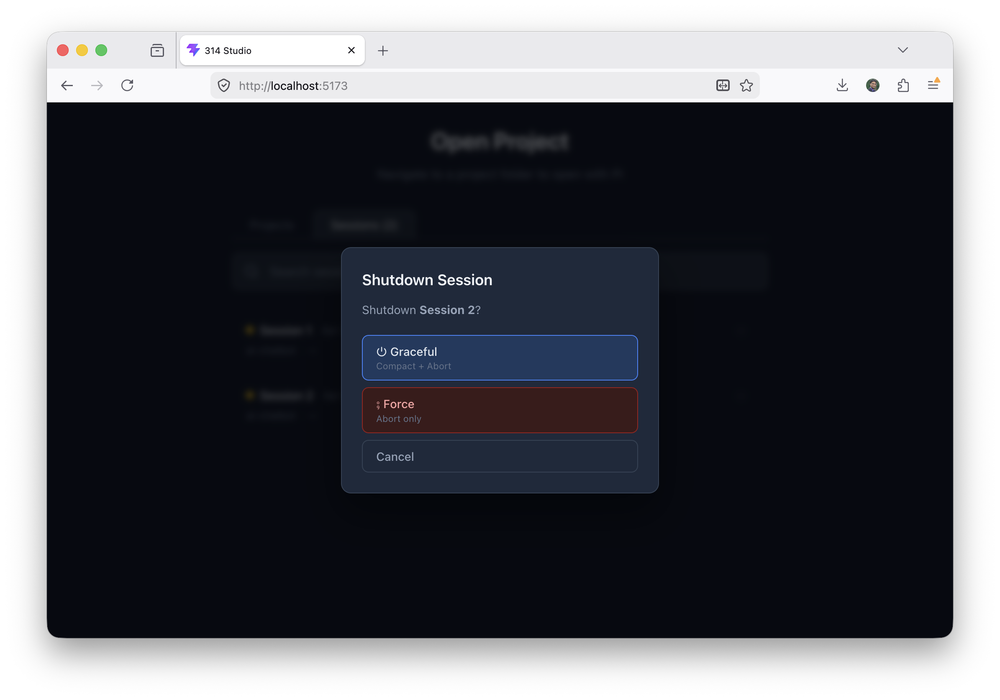

# 314 Studio

A web interface for [Pi](https://github.com/badlogic/pi-mono) — the AI coding agent toolkit by Mario Zechner.

Pi is an interactive coding agent that runs in your terminal. It understands your codebase, performs read/write/edit/bash operations, and works across sessions. This project wraps Pi with a **FastAPI backend** and **React frontend** to give you a browser-based workspace where you can manage sessions, browse files, and chat with the agent — all from a single page.

> **Pi CLI** is the core agent. This project is a *web UI layer* on top of it, not a replacement.

## Prerequisites

Before running this project, make sure you have these installed:

### Required tools

| Tool | Version | Why | Install |
|------|---------|-----|---------|
| **[Node.js](https://nodejs.org/)** | ≥ 18 | Required for bun and npm | `brew install node` (macOS) or [nodejs.org](https://nodejs.org/) |
| **[Bun](https://bun.sh/)** | Latest | Frontend runtime and package manager | `curl -fsSL https://bun.sh/install \| bash` |
| **[Python](https://python.org/)** | ≥ 3.13 | Backend language | `brew install python` (macOS) or [python.org](https://python.org/) |
| **[uv](https://docs.astral.sh/uv/)** | Latest | Python package & project manager | `curl -LsSf https://astral.sh/uv/install.sh \| sh` |
| **[Pi CLI](https://github.com/badlogic/pi-mono)** | Latest | The coding agent itself (spawned by backend) | `npm install -g @mariozechner/pi-coding-agent` |

### Pi authentication

The Pi agent needs an LLM provider configured. Choose **one**:

```bash
# Option A: API key (Anthropic recommended)
export ANTHROPIC_API_KEY=sk-ant-...

# Option B: Interactive login (supports OpenAI, Anthropic, Google, etc.)
pi --login
```

Verify Pi works from the command line before starting the server:

```bash
pi --list-models
```

### Optional

| Tool | Why |
|------|-----|
| **Git** | Version control (used by the agent for operations) |
| **Docker** | Not required — Pi runs as a native subprocess |

## Quick Start

All three components (backend, frontend, Pi agent) must be running simultaneously.

### 1. Start the backend

The backend spawns `pi --mode rpc` processes on demand when you create sessions.

```bash
cd backend
uv run uvicorn app.main:app --reload   # :8000, auto-reload
```

API docs are available at **http://localhost:8000/docs**.

### 2. Start the frontend (in a separate terminal)

```bash
cd frontend
bun dev                                 # :5173
```

### 3. Open the app

Navigate to **http://localhost:5173** and:

1. **Select a folder** — browse any project directory on your filesystem
2. **Pick a model** — available models are fetched from cache (no session needed yet)
3. **Start chatting** — sessions run as separate `pi --rpc` processes

## Screenshots

### Project Selection
Choose a project directory from your filesystem to work with.



### Model Selection
Select an AI model for your session. Pi fetches available models via RPC.



### Workspace View
The main workspace with file browser on the left and chat panel on the right.



### Active Sessions
View and manage active Pi sessions. Each session runs its own `pi --rpc` process.



### Exit Session
Close a session to compact, abort, and terminate the underlying process.



### Running tests

```bash
cd tests
API_BASE=http://127.0.0.1:8000 WS_BASE=ws://127.0.0.1:8000 uv run pytest -v

# Or run specific flows:
API_BASE=http://127.0.0.1:8000 WS_BASE=ws://127.0.0.1:8000 \
  uv run integration_test_harness.py --flows browse chat file-browse

# Full suite (all 7 flows, ~117 tests):
API_BASE=http://127.0.0.1:8000 WS_BASE=ws://127.0.0.1:8000 \
  uv run python integration_test_harness.py
```

## Architecture

```
Client ──REST──→ Backend (metadata only: list, create, browse, read)
       ──WS────→ Backend ──stdin/stdout──→ pi --rpc process
                       (all Pi RPC: prompt, set_model, compact, etc.)
```

### Core Principle

**REST = metadata, WebSocket = all Pi RPC actions.**

- Session creation returns a `SessionRecord` with `session_id`
- Model switching via REST only updates metadata; the actual `set_model` is sent by the WS relay
- Sessions outlive WebSocket connections — disconnect/reconnect is painless
- Each session runs its own `pi --mode rpc` process

### Session Lifecycle

```
creating → running ──WS disconnect→ running (ws disconnected)
                    │              └──WS reconnect→ running (ws reconnected)
                    ├──client message → forwarded to stdin
                    └──process events → event buffer → WS relay
                    │
close(compact) → stopped (process terminated, record removed)
delete(abort)  → stopped (process terminated, record removed)
```

## API Endpoints

### Projects
| Method | Endpoint | Description |
|--------|----------|-------------|
| `GET` | `/api/` | List project folder names under `~/Projects` |
| `GET` | `/api/projects/info` | Project details + sessions (`?project_path=...`) |
| `POST` | `/api/projects/` | Create session (`?project_path=...`, body: `{model_id, name?}`) |

### Sessions
| Method | Endpoint | Description |
|--------|----------|-------------|
| `POST` | `/api/projects/{id}/close` | Compact + abort + terminate |
| `POST` | `/api/projects/{id}/delete` | Abort + terminate (no compact) |
| `POST` | `/api/projects/{id}/model` | Switch model metadata |

### Files
| Method | Endpoint | Description |
|--------|----------|-------------|
| `GET` | `/api/browse` | Browse directories recursively |
| `GET` | `/api/projects/files` | List files in project dir |
| `GET` | `/api/projects/files/read` | Read file contents |

### Models
| Method | Endpoint | Description |
|--------|----------|-------------|
| `GET` | `/api/models/` | List available models — cached at startup (no session required) |

### WebSocket
| Endpoint | Description |
|----------|-------------|
| `WS /api/projects/ws?session_id=...` | Bidirectional JSON relay |

## Project Structure

```
├── backend/app/
│   ├── main.py              # FastAPI entry point
│   ├── api/                 # Route modules
│   ├── schemas/             # Pydantic models
│   └── session_manager.py   # Core: pi --rpc lifecycle
├── frontend/src/
│   ├── views/               # FolderSelector, ModelSelector, Workspace
│   ├── components/          # ProjectTree, FilePreview, ChatPanel
│   ├── hooks/               # useModels, useFileContent, useWebSocket
│   ├── store/AppContext.tsx # Shared state
│   └── services/api.ts      # API client
├── tests/                   # Integration tests (pytest, uv)
└── docs/                    # Design plans
```

## Current Status

| Area | Status |
|------|--------|
| Backend API | ✅ Complete |
| Session Manager | ✅ Complete |
| Frontend UI | ✅ Complete |
| Frontend/Backend wiring | ✅ Complete |
| WebSocket relay | ✅ Complete |
| Extension UI handling | ✅ Complete |
| Integration tests | ✅ 117 passed, 0 failed (all 7 flows) |
